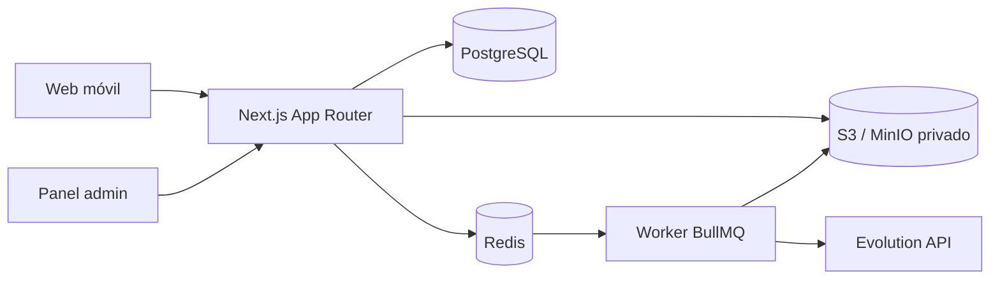

# Arquitectura

El monorepo separa `apps/web`, `apps/worker` y paquetes de base de datos, dominio, configuración y utilidades. Los Route Handlers traducen HTTP; validadores, servicios de dominio y repositorios mantienen las reglas fuera de React.

## Autenticación y usuarios

Auth.js mantiene sesiones JWT de corta duración en cookies HttpOnly/SameSite. Las credenciales se verifican con Argon2id. Cinco fallos bloquean la cuenta durante 15 minutos. Los usuarios creados por administración quedan en `PENDING_PASSWORD_CHANGE` y deben cambiar su clave. Las respuestas de acceso fallido son deliberadamente genéricas para impedir enumeración.

## Modelo de Fase 1

`users` contiene identidad y estado; `user_profiles`, datos públicos/configurables; `plans` y `subscriptions`, límites SaaS; `password_reset_tokens`, tokens hashados de un solo uso; `sessions`, soporte para sesiones persistentes futuras; y `audit_logs`, acciones sensibles con correlation ID. Las fases siguientes amplían el esquema mediante migraciones aditivas.
